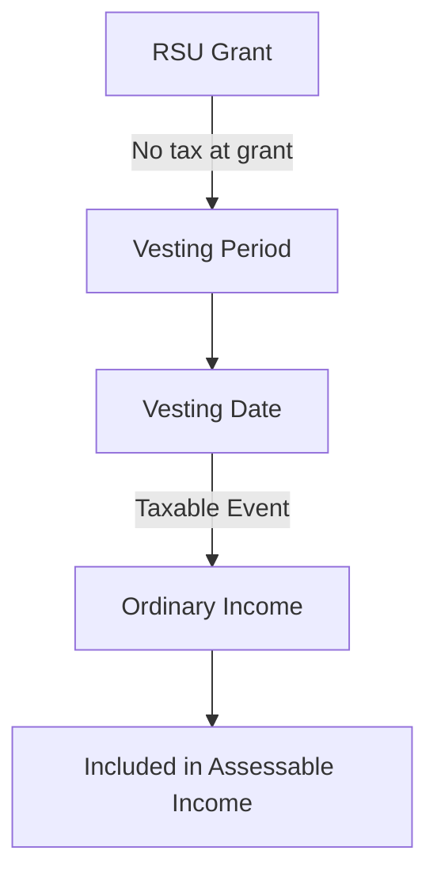
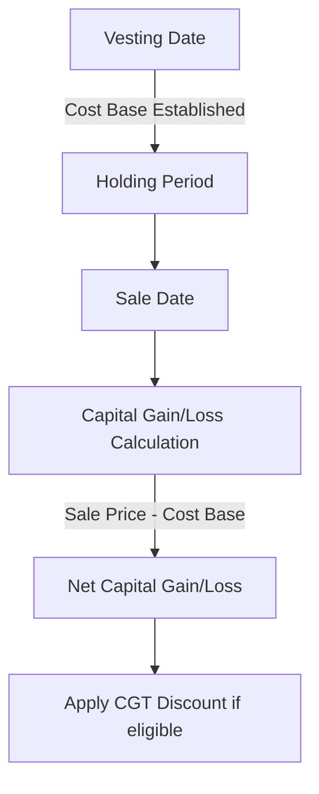
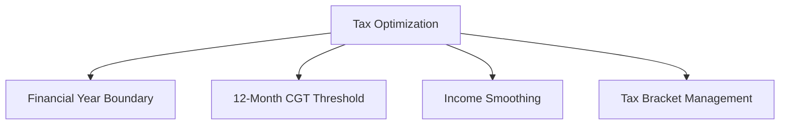

# Australian Tax Specifics for RSU Manager

## Overview of RSU Taxation in Australia

In Australia, the taxation of Restricted Stock Units (RSUs) involves two key tax events:

1. **Taxation at Vesting**: When RSUs vest, they are treated as ordinary income
2. **Capital Gains Tax (CGT)**: When the shares acquired from RSUs are sold, CGT applies to any gain or loss since vesting

## 1. Income Tax Treatment at Vesting

### 1.1 Tax Point

- RSUs are taxed at the time of **vesting** (not at grant)
- The market value of the shares at vesting is included in the employee's assessable income
- This is reported as employment income on the individual tax return
- Tax is typically withheld by the employer at vesting (Pay As You Go - PAYG)

### 1.2 Progressive Tax Rates (FY 2024-25)

| Taxable Income          | Tax Rate                                |
|-------------------------|----------------------------------------|
| $0 - $18,200            | Nil                                    |
| $18,201 - $45,000       | 19% of excess over $18,200             |
| $45,001 - $120,000      | $5,092 + 32.5% of excess over $45,000  |
| $120,001 - $180,000     | $29,467 + 37% of excess over $120,000  |
| $180,001+               | $51,667 + 45% of excess over $180,000  |

### 1.3 Medicare Levy

- 2% of taxable income applies to most taxpayers
- Medicare Levy Surcharge (MLS) may apply (1-1.5%) if income exceeds thresholds and no private health insurance
- RSU income contributes to these thresholds

### 1.4 HECS/HELP Debt Repayments

| Repayment Income        | Repayment Rate                         |
|-------------------------|----------------------------------------|
| Below $48,361           | Nil                                    |
| $48,361 - $55,836       | 1.0%                                   |
| $55,837 - $59,186       | 2.0%                                   |
| $59,187 - $62,738       | 2.5%                                   |
| $62,739 - $66,502       | 3.0%                                   |
| (continues with higher rates for higher incomes)                  |

- RSU income is included in HECS/HELP repayment income
- Can significantly increase repayment obligations
- Important consideration for employees with education debt

## 2. Capital Gains Tax (CGT) Treatment

### 2.1 CGT Calculation

- **Cost Base**: Market value of shares at vesting (already taxed as income)
- **Capital Gain**: Sale price minus cost base
- **CGT Event**: Occurs when shares are sold

### 2.2 CGT Discount

- 50% CGT discount applies if shares are held for more than 12 months after vesting
- Significantly reduces tax on capital gains
- Strategic consideration for timing of sales

### 2.3 Capital Losses

- Can be offset against capital gains in the same income year
- Excess capital losses can be carried forward indefinitely
- Cannot be offset against ordinary income
- Tax-loss harvesting opportunities for employees with multiple share lots

### 2.4 CGT Reporting

- Reported in the Capital Gains section of the tax return
- Requires detailed record-keeping of:
  - Vesting dates and values
  - Sale dates and prices
  - Holding periods
  - Cost base adjustments (if any)

## 3. Tax Reporting Requirements

### 3.1 Tax Return Sections

| Tax Return Section      | RSU-Related Information                 |
|-------------------------|----------------------------------------|
| Item 1 - Salary/Wages   | Value of RSUs at vesting               |
| Item 18 - Capital Gains | Gains/losses from selling RSU shares   |
| Item M1 - Medicare Levy | RSU income affects Medicare obligations |
| Item M2 - Medicare Levy Surcharge | RSU income may trigger MLS   |
| HELP/TSL/SSL Debt       | RSU income affects repayment amounts   |

### 3.2 Required Documentation

- **Employee Payment Summary**: Shows RSU income included in employment income
- **Employee Share Scheme (ESS) Statement**: Details of RSU vestings
- **Contract Notes**: For share sales (provided by broker)
- **CGT Records**: Calculation of capital gains/losses

## 4. Foreign Income Considerations

### 4.1 Double Taxation Issues

- Australian tax residents are taxed on worldwide income
- RSUs from foreign employers may be subject to tax in multiple countries
- Foreign Income Tax Offset (FITO) may be available for tax paid overseas
- Complex area requiring careful documentation

### 4.2 Foreign Currency Considerations

- If RSUs are in foreign currency (e.g., USD), currency fluctuations can affect:
  - Income calculation at vesting
  - Cost base for CGT purposes
  - Capital gain/loss calculation
- ATO requires conversion to AUD at specific exchange rates

## 5. Superannuation Implications

### 5.1 Superannuation Guarantee

- RSU income is generally not subject to Superannuation Guarantee (SG) contributions
- Not considered ordinary time earnings for SG purposes
- May affect retirement planning strategies

### 5.2 Concessional Contributions

- Employees may consider voluntary super contributions to offset high-income years
- Tax-effective strategy when receiving large RSU vestings
- Subject to concessional contribution caps ($27,500 per annum)

## 6. Tax Optimization Strategies

### 6.1 Timing Strategies

- **Financial Year Boundary**: Timing sales near June/July to manage which tax year gains fall into
- **CGT Discount Threshold**: Ensuring 12-month holding period is met before selling
- **Income Smoothing**: Spreading sales across multiple financial years
- **Tax Bracket Management**: Avoiding pushing income into higher tax brackets

### 6.2 Specific Australian Strategies

- **Salary Sacrifice**: Increasing super contributions in years with large RSU vestings
- **Charitable Donations**: Tax-deductible donations to offset high-income years
- **Investment Bond Strategy**: Using investment bonds for long-term tax-effective investing of RSU proceeds
- **Family Trust Distributions**: For those with family trusts, distributing income strategically

## 7. ATO Guidance and Compliance

### 7.1 Key ATO Resources

- **TD 2001/1**: Taxation Determination on employee share schemes
- **PS LA 2008/3**: ATO practice statement on ESS valuation
- **Employee Share Schemes**: Dedicated section on ATO website
- **Annual Tax Return Instructions**: Updated yearly with ESS reporting requirements

### 7.2 Common Compliance Issues

- **Underreporting RSU Income**: Failure to include RSU vestings in assessable income
- **Incorrect Cost Base**: Using grant price instead of vesting price for CGT calculations
- **Missing CGT Discount**: Not applying or incorrectly applying the 50% CGT discount
- **Inadequate Record-Keeping**: Failing to maintain sufficient documentation

## 8. Implementation in RSU Manager

### 8.1 EOY Tax Return Assistant Implementation

- Incorporate progressive tax rates table with annual updates
- Calculate Medicare levy and surcharge based on total income
- Include HECS/HELP repayment calculator
- Generate ATO-aligned reports matching specific item codes
- Provide record-keeping templates for CGT events

### 8.2 Tax Optimization Engine Implementation

- Build financial year boundary analysis for optimal sale timing
- Implement CGT discount eligibility tracking
- Create tax bracket threshold alerts
- Develop income smoothing recommendations across financial years
- Include superannuation contribution optimization suggestions

### 8.3 Data Requirements

- Current Australian tax rates and thresholds (updated annually)
- Medicare levy and surcharge thresholds
- HECS/HELP repayment thresholds and rates
- CGT discount rules and eligibility criteria
- ATO reporting requirements and item codes
