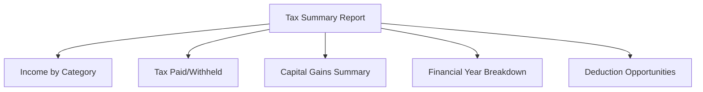
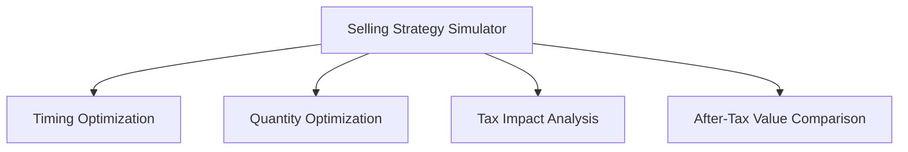

# RSU Manager Enhancement Plan

## Priority Components

Based on user feedback, we will prioritize the following components:

1. EOY Tax Return Assistant
2. Tax Optimization Engine

## 1. EOY Tax Return Assistant

### Purpose
Help employees prepare accurate tax returns by organizing RSU-related tax information in a format that aligns with Australian tax return requirements.

### Key Features

#### 1.1 Tax Summary Report

- **Income by Category**: Separate RSU income into appropriate tax categories
  - Income at vesting (ordinary income)
  - Capital gains (short-term vs. long-term)
  
- **Tax Paid/Withheld**: Track tax already paid or withheld
  - Tax withheld at vesting
  - Estimated tax paid on capital gains
  
- **Capital Gains Summary**: Detailed breakdown of capital gains
  - Calculation method explanation
  - 50% CGT discount eligibility
  - Net capital gain after losses and discounts
  
- **Financial Year Breakdown**: Organize all data by Australian financial year (July-June)
  - Multiple year support for historical analysis
  - Year-to-year comparison

#### 1.2 ATO-Ready Exports
- Generate reports that map directly to specific ATO tax return fields
- Include item codes and labels matching the official tax return
- Provide explanations for which sections of the tax return are relevant
- Export in formats compatible with popular tax preparation software

#### 1.3 Tax Document Organizer
- Checklist of required documents for RSU-related tax reporting
- Document upload and storage capability
- Reminder system for important tax dates and deadlines
- Document templates for common RSU tax scenarios

#### 1.4 Year-over-Year Comparison
- Compare RSU income and tax across multiple financial years
- Identify trends and anomalies
- Highlight significant changes that might affect tax strategy

#### 1.5 Pre-fill Integration Guidance
- Instructions on how to reconcile RSU data with ATO pre-fill information
- Explanation of common discrepancies and how to resolve them
- Guidance on additional information needed beyond pre-fill data

### UI/UX Design

#### New "Tax Return" Tab
- Clean, form-like interface similar to tax preparation software
- Step-by-step guided process
- Clear separation between different tax components
- Visual indicators for completed sections

#### Interactive Elements
- Toggles for different tax scenarios
- Drill-down capabilities for detailed information
- Tooltips explaining tax concepts and calculations
- Warning indicators for potential issues or discrepancies

#### Output Formats
- On-screen summary view
- Printable PDF reports
- Excel exports with formulas intact
- Data files compatible with tax software

### Data Requirements
- Complete vesting schedule with dates and values
- Sale records with dates, prices, and quantities
- Tax rates and thresholds for relevant financial years
- Record of tax already paid or withheld
- User's tax residency status
- Other income information (optional, for more accurate calculations)

### Integration Points
- Use existing vesting data from the Vesting Schedule tab
- Incorporate sales data from the RSU Sell Tracker tab
- Extend the current Financial Year grouping functionality
- Enhance the PDF export capability for tax-specific reports

## 2. Tax Optimization Engine

### Purpose
Provide employees with data-driven recommendations to optimize their RSU selling strategy for tax efficiency.

### Key Features

#### 2.1 Selling Strategy Simulator

- **Timing Optimization**: Analyze optimal times to sell RSUs
  - Financial year considerations (deferring to lower-income years)
  - Long-term vs. short-term capital gains implications
  - Market timing considerations (optional)
  
- **Quantity Optimization**: Determine optimal quantities to sell
  - Tax bracket threshold analysis
  - Partial sale recommendations
  - Dollar-cost averaging approaches
  
- **Tax Impact Analysis**: Calculate tax implications of different strategies
  - Progressive tax rates application
  - Medicare levy implications
  - HECS/HELP repayment thresholds
  
- **After-Tax Value Comparison**: Compare net proceeds after all taxes

#### 2.2 Tax-Loss Harvesting
- Identify opportunities to offset capital gains with capital losses
- Recommend specific lots to sell for optimal tax outcomes
- Calculate potential tax savings from different harvesting strategies
- Warnings about wash sale rules and other limitations

#### 2.3 Timing Recommendations
- Alert for approaching 12-month holding period milestones
- Financial year boundary considerations (June/July timing)
- Recommendations based on expected income changes
- Tax rate threshold proximity alerts

#### 2.4 Scenario Comparison
- Side-by-side comparison of different selling strategies
- Sensitivity analysis for different stock price scenarios
- Risk assessment of different approaches
- Visualization of trade-offs between strategies

#### 2.5 Multi-Year Planning
- Long-term tax planning across multiple financial years
- Income smoothing strategies
- Retirement planning considerations
- Superannuation contribution strategies related to RSU income

### UI/UX Design

#### New "Optimize" Tab
- Dashboard-style interface with key metrics
- Interactive sliders for scenario testing
- Split-screen comparisons of different strategies
- Visual indicators for recommended actions

#### Interactive Elements
- Drag-and-drop interface for testing selling scenarios
- Real-time calculation updates as parameters change
- "What-if" scenario builder
- Strategy saving and comparison tools

#### Visualization Components
- Strategy comparison charts
- Tax impact heat maps
- Timeline visualizations with tax events
- After-tax value projections

### Data Requirements
- Complete vesting schedule with dates and values
- Historical and current stock price data
- Australian tax brackets and rates
- User's other income information (for accurate tax bracket calculations)
- User's tax residency status
- HECS/HELP debt status (if applicable)

### Integration Points
- Use existing vesting data from the Vesting Schedule tab
- Incorporate sales data from the RSU Sell Tracker tab
- Extend the current tax calculation functionality
- Enhance the visualization capabilities

## Implementation Approach

### Phase 1: Foundation (4-6 weeks)
- Enhance the tax calculation engine to support progressive tax rates
- Implement financial year data organization improvements
- Create the basic structure for the new tabs
- Develop core data models for tax optimization

### Phase 2: EOY Tax Return Assistant (6-8 weeks)
- Implement Tax Summary Report functionality
- Develop ATO-ready export formats
- Create the Tax Document Organizer
- Build Year-over-Year comparison features
- Add Pre-fill Integration Guidance

### Phase 3: Tax Optimization Engine (8-10 weeks)
- Implement Selling Strategy Simulator
- Develop Tax-Loss Harvesting recommendations
- Create Timing Recommendations system
- Build Scenario Comparison functionality
- Add Multi-Year Planning capabilities

### Phase 4: Integration and Refinement (4-6 weeks)
- Integrate all components with existing functionality
- Enhance visualizations across the application
- Implement user feedback mechanisms
- Optimize performance and usability
- Conduct user testing and make refinements

## Technical Considerations

### Data Storage
- Consider implementing data persistence for user settings and historical data
- Evaluate options for secure storage of sensitive tax information
- Design efficient data structures for tax calculations and simulations

### Calculation Accuracy
- Implement rigorous validation for tax calculations
- Include disclaimers about seeking professional tax advice
- Consider annual updates for tax rate changes and legislation updates

### Performance
- Optimize for responsive UI during complex calculations
- Consider background processing for intensive simulations
- Implement efficient data handling for large RSU portfolios

## Next Steps

1. Detailed requirements gathering for each component
2. UI/UX wireframing for new tabs and features
3. Data model design for enhanced tax calculations
4. Development of progressive tax calculation engine
5. Implementation of EOY Tax Return Assistant core features
